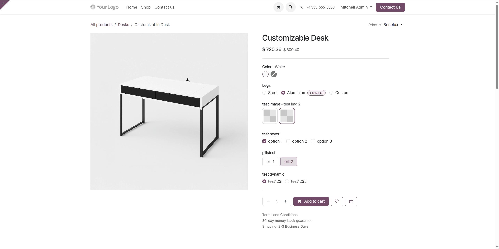

# Website Sale Variant Auto Switcher

Automatically switch to valid product variants instead of showing "This combination does not exist" errors in your Odoo eCommerce store.

## Overview

This module enhances the product variant selection experience by automatically switching to valid product combinations instead of showing frustrating error messages. Similar to how major eCommerce platforms like Amazon handle variant selection, it intelligently guides customers to available product combinations, reducing cart abandonment and improving conversion rates.

## Key Features

- **Automatic Variant Switching** - When a customer selects an invalid combination of product attributes, the module automatically switches to the closest valid combination that matches their intent.
- **Works with Odoo's Visual Indicators** - Integrates seamlessly with Odoo's built-in exclusion indicators that show unavailable options, automatically switching to valid alternatives when customers select them anyway.
- **Preserves User Intent** - The algorithm prioritizes customer preferences by choosing the closest matching valid variant, keeping as many of the original selections as possible.
- **Theme Compatible** - Works with all standard Odoo themes without requiring custom styling.
- **Zero Configuration** - Activates automatically after installation. No setup required.
- **Safe & Reliable** - Only affects interactive product pages, never touches orders or historical data.

## How It Works

1. Customer is on a product page with variant selection
2. Some attribute combinations are shown as unavailable (crossed out) via Odoo's built-in "Exclude for" settings or archived variants
3. When the customer clicks an unavailable option, instead of showing an error, the module automatically switches to the closest valid variant
4. The algorithm preserves as many of the customer's original selections as possible

## Perfect For

- Products with multiple attribute combinations
- Complex variant exclusion rules ("Exclude for" settings)
- Archived variants to disable certain combinations
- High variant count products requiring advanced UX

## Benefits

- Reduced cart abandonment
- Improved conversion rates
- Professional customer experience matching major eCommerce platforms
- No configuration required - works out of the box

## Installation

1. Download and install the module through the Odoo Apps interface or place it in your addons path
2. Update your app list and install "Website Sale Variant Auto Switcher"
3. The module activates automatically for all products with variants
4. No configuration or setup required

## Compatibility

- Odoo 17, 18, and 19 Community & Enterprise
- All standard Odoo themes
- Works with "always", "dynamic", and "never" (no_variant) attribute creation modes

## Limitations

Automatic switching cannot help when:
- Attributes have variant creation set to "Never" (no_variant)
- Dynamic attributes where no variant has been created yet for the selected value
- No valid combination exists at all for the selection

## Technical Details

- **Backend Controller**: Intercepts variant combination requests and determines the closest valid combination
- **Frontend JavaScript**: Automatically updates the UI to reflect the valid combination selected by the backend
- **Intelligent Algorithm**: Preserves as many original selections as possible when finding valid alternatives

## License

This module is licensed under LGPL-3.

## Author

**Codemarchant** - [codemarchant.com](https://codemarchant.com)

Check out our other apps, including [Odoo MCP Studio](https://apps.odoo.com/apps/modules/browse?author=Codemarchant) for AI-powered Odoo development.
